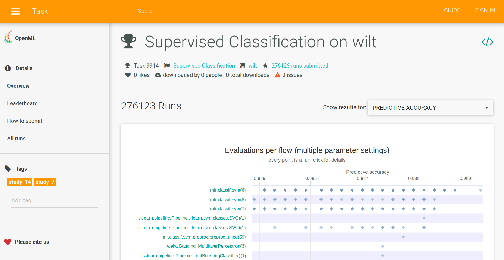
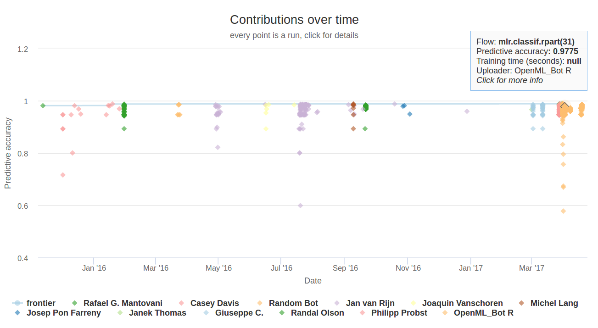

```{r setup, include=FALSE}
library("knitr")
opts_chunk$set(message = FALSE, cache = TRUE, eval = TRUE)
library("OpenML")
library("ggplot2")
```


---

[openml.org](http://www.openml.org/)

```{r, out.width = "800px", eval=TRUE, echo = FALSE}
knitr::include_graphics("screenshot.png")
```


---

```{r, out.width = "800px", eval=TRUE, echo = FALSE}
knitr::include_graphics("overview.png")
```


---

```{r, out.width = "800px", eval=TRUE, echo = FALSE}

```


---

```{r, out.width = "800px", eval=TRUE, echo = FALSE}

```


## For whom is OpenML?

- Domain scientists
- Data analysts
- Algorithm developers
- Students
- Teachers
- ...


## OpenML with R
```{r, eval=FALSE}
tsk.id <- 10
tsk <- getOMLTask(tsk.id)

lrn <- makeLearner("classif.cforest", ntree = 1000, mtry = 4)
run <- runTaskMlr(task = tsk, learner = lrn)
rn.id <- uploadOMLRun(run, confirm.upload = FALSE)
```

```{r, echo=FALSE}
tsk.id <- 10
rn.id <- 6067862
```

```{r}
evals <- listOMLRunEvaluations(task.id = tsk.id)
```

---

```{r, fig.height=4}
mlrevals <- evals[grep("mlr", evals$flow.name), ]
mlrevals$my.run <- mlrevals$run.id == rn.id
ggplot(mlrevals, aes(x = predictive.accuracy, 
                     y = flow.name, 
                     color = my.run)) + 
  geom_point()
```


---

#### Cool stuff people are already doing with OpenML
```{r, out.width = "700px", eval=TRUE, echo = FALSE}
knitr::include_graphics("../useR2017_tutorial/slides_tutorial_files/cool_stuff_text.png")
```


## Papers

G. Casalicchio, J. Bossek, M. Lang, D. Kirchhoff, P. Kerschke, B.
Hofner, H. Seibold, J. Vanschoren, and B. Bischl.    
**OpenML: An R package to connect to the machine learning platform OpenML.**   
*Computational Statistics, 2017.*    
doi: 10.1007/s00180-017-0742-2.

J. Vanschoren, J. N. van Rijn, B. Bischl, and L. Torgo.    
**OpenML: Networked science in machine learning.**   
*SIGKDD Explorations, 15(2):49–60, 2014.*    
doi: 10.1145/2641190.2641198.


## Resources

General:

- [OpenML bootcamp](https://www.openml.org/guide/bootcamp)
- [Overview APIs + links to further resources](https://www.openml.org/guide/api)
- [Overview integrations + links to further resources](https://www.openml.org/guide/integrations)
- [Benchmarking with OpenML](https://www.openml.org/guide/benchmark)
- [Blog post on basic components](https://medium.com/open-machine-learning/basic-components-of-openml-a5745634c664)
- [Blog post on my first impression](http://heidiseibold.github.io/r/2016/05/02/OpenML/)

R:

- [These slides](http://openml.github.io/articles/slides/talk_cenisbs_2017/OpenML_CENISBS.html)
- [Tutorial at useR! 2017](http://openml.github.io/articles/slides/useR2017_tutorial/)
- [Blog post on parallel benchmarking](http://mlr-org.github.io/Parallel_benchmarking_with_OpenML_and_mlr/)

<!-- # A use case: a benchmark study with ctree -->


<!-- ## Study the behaviour of different parameter settings of ctree -->

<!-- Check performance with respect to **predictive accurancy** -->
<!-- (percentage of instances that are classified correctly) -->


<!-- ## Steps -->
<!-- - Create the flow -->
<!-- - Download the tasks -->
<!-- - Create runs (run flows on tasks) -->
<!-- - Upload runs -->
<!-- - Collect all information -->
<!-- - Visualise -->

<!-- ## Which learners to use -->
<!-- ```{r} -->
<!-- lrn.list <- list( -->
<!--   makeLearner("regr.ctree", testtype = "Bonferroni"), -->
<!--   makeLearner("regr.ctree", testtype = "Univariate"), -->
<!--   makeLearner("regr.ctree", testtype = "Teststatistic") -->
<!-- ) -->
<!-- ``` -->


<!-- ## Download the relevant tasks -->
<!-- - Select relevant tasks -->
<!-- ```{r} -->
<!-- taskinfo_all <- listOMLTasks( -->
<!--   task.type = "Supervised Regression", -->
<!--   number.of.instances = c(80, 10^6), -->
<!--   number.of.features = c(3, 50), -->
<!--   evaluation.measures = "mean_absolute_error", -->
<!--   estimation.procedure = "10-fold Crossvalidation" -->
<!-- ) -->

<!-- set.seed(2017) -->
<!-- taskinfo <- taskinfo_all[sample(1:NROW(taskinfo_all), 5), ] -->
<!-- ``` -->
<!-- - Download tasks -->
<!-- ```{r} -->
<!-- tid <- taskinfo$task.id -->
<!-- tasks <- lapply(tid, getOMLTask) -->
<!-- names(tasks) <- tid -->
<!-- ``` -->

<!-- ---- -->

<!-- ```{r, echo=FALSE} -->
<!-- kable(taskinfo[, c("name", "number.of.instances", "number.of.features",  -->
<!--                    "number.of.missing.values")], row.names = FALSE) -->
<!-- ``` -->


<!-- ## Create runs (run flows on tasks) -->
<!-- - Set up grid to run each learner on each task -->
<!-- ```{r} -->
<!-- grid <- expand.grid(task.id = taskinfo$task.id,  -->
<!--                     lrn.ind = seq_along(lrn.list)) -->
<!-- ``` -->
<!-- - Run learners on tasks -->
<!-- ```{r, eval=FALSE} -->
<!-- run_lt <- function(gr) { -->
<!--   tid <- gr["task.id"] -->
<!--   lid <- gr["lrn.ind"] -->
<!--   runTaskMlr(task = tasks[[as.character(tid)]], -->
<!--              learner = lrn.list[[lid]]) -->
<!-- } -->
<!-- runs <- apply(grid, 1, run_lt) -->
<!-- ``` -->


<!-- ## Upload runs -->
<!-- ```{r, eval=FALSE} -->
<!-- run.id <- lapply(runs, uploadOMLRun, tags = "study_65",  -->
<!--                  confirm.upload = FALSE) -->
<!-- grid$run.id <- unlist(run.id) -->
<!-- save(grid, file = "grid_splittest.rda")  -->
<!-- ``` -->
<!-- ```{r, echo=FALSE} -->
<!-- load(file = "grid_splittest.rda") -->
<!-- ``` -->
<!-- ```{r} -->
<!-- grid -->
<!-- ``` -->

<!-- ## Collect all information -->
<!-- ```{r} -->
<!-- runeval <- cbind(grid, listOMLRunEvaluations(run.id = grid$run.id)) -->
<!-- names(runeval) -->
<!-- ``` -->

<!-- ## Visualise -->
<!-- ```{r, fig.height=3, fig.width=7, out.width='900px'} -->
<!-- ggplot(runeval, aes(x = splittest, y = predictive.accuracy,  -->
<!--                     color = data.name, group = data.name)) + -->
<!--   geom_point() + geom_line() -->
<!-- ``` -->
<!-- Similar visualisation can be found on  -->
<!-- [openml.org/f/5434](http://www.openml.org/f/5434) -->

<!-- --- -->
<!-- Why does the heart-switzerland data behave the way it does? -->
<!-- ```{r} -->
<!-- tasks[["9948"]] -->
<!-- ``` -->
<!-- Let's take a closer look at the data set: -->
<!-- [openml.org/d/1513](http://www.openml.org/d/1513) -->


