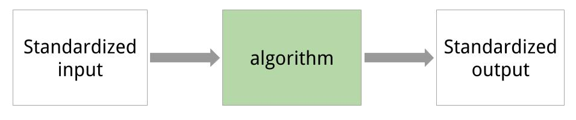

<!-- For this to work, install xaringan (devtools::install_github('yihui/xaringan')) -->

```{r setup, include=FALSE}
options(htmltools.dir.version = FALSE)
knitr::opts_chunk$set(dpi = 300, cache = TRUE, message = FALSE, eval = TRUE)
library(OpenML)
setOMLConfig(confirm.upload = FALSE)
set.seed(123)
```

- If you haven't done so yet, create an account on [OpenML.org](www.openml.org).

- If you haven't done so yet, install the OpenML R package and one of the packages farff or RWeka:
```{r, eval=FALSE}
install.packages("OpenML")
install.packages("farff")  # or install.packages("RWeka")
```
```{r}
library("OpenML")
```


- If something is not clear / you have a question / you have a problem, please **let us know**!

- We will have lots of practicals, if you are faster than others, you can 
check out https://www.openml.org/guide or help others.


---
Help


---
## OpenML useR! Tutorial

Learning goals:

- Understand the **potentials** of OpenML

- Use the OpenML **online platform** and the **R package**
  + Creating, uploading and downloading 
  + Running algorithms on OpenML tasks
  
- Know about cool OpenML **projects** and how to **get involved**


---
### Installation and configuration 
<!-- [3 minutes, Joaquin] -->

You need OpenML and an ARFF reader

```{r, eval=FALSE}
install.packages(c("OpenML","farff"))
```
```{r}
library("OpenML")
```

---
You also need an OpenML API key to talk to the server

```{r, eval=FALSE}
setOMLConfig(apikey = "c1994bdb7ecb3c6f3c8f3b35f4b47f1f")
```

- Find your own key in your OpenML profile

 
---
Permanently save your API disk to your config file (~/.openml/config)

```{r, eval=FALSE}
saveOMLConfig(apikey = "c1994...47f1f", overwrite=TRUE)
```

Other configuration options:
- `server`: default https://www.openml.org/api/v1
- `cachedir`: cache directory
- `verbosity`: 0 (normal) - 2 (debug)
- `arff.reader`: 'farff' (default) or 'RWeka'
- `confirm.upload`: default FALSE

View your configuration
```{r}
getOMLConfig()
```

---
class:inverse

### *Practical*  
<!-- [5 minutes, Joaquin] -->

- Install the OpenML R package (if you haven't done so yet)
- Add your API-key to your config file
- Configure OpenML to your liking

---
### Listing datasets
<!-- [7 minutes, Joaquin] -->
```{r}
datasets = listOMLDataSets() # get first 5K results (LIMIT option) 
colnames(datasets)
```

---
### Listing datasets
```{r}
datasets[1:15, c(1,2,11,12)] # subset for compact display
```

---
### Listing datasets
Find datasets by name
```{r}
str(subset(datasets, name == "eeg-eye-state"))
```

---
### Listing tasks 
```{r}
tasks = listOMLTasks() # limits results again
colnames(tasks)[1:20]
```

---
### Listing tasks 
```{r}
tasks[1:5, 1:9]
```


---
### Listing tasks 
```{r}
listOMLTasks(data.name = "GesturePhaseSegmentationRAW")[,1:8]
```

---
### Listing flows 
```{r}
flows = listOMLFlows()
flows[56:63, c(1,2,6,7)]
```

---
### Listing runs and evaluations
Runs and evaluations need at least one of: task.id, flow.id, run.id, uploader.id, tag
```{r}
runs = listOMLRuns(task.id = 146567L)
head(runs)
```

---
### Listing runs and evaluations
```{r}
evals = listOMLRunEvaluations(task.id = 146567L)
evals[, c("flow.name", "predictive.accuracy")]
```

---
class:inverse
### *Practical*  
<!-- [5 minutes, Joaquin] -->
- List all datasets having between 100K and 200K observations and <= 5 features
- List all regression tasks corresponding to data sets having between 50 and 55 observations.
- Find the data.id for dataset 'GesturePhaseSegmentationRAW'
- List all `predictive.accuracy` evaluations for task 146567

---
class:inverse
### *Solution*  
- List all datasets having between 100K and 200K observations and <= 5 features
```{r}
datasets = listOMLDataSets(number.of.instances = c(100000, 200000), 
  number.of.features = c(1, 5))
str(datasets, list.len = 10)
```

---
class:inverse
### *Solution*  
- List all regression tasks corresponding to data sets having between 50 and 55 observations.
```{r}
tasks = listOMLTasks(task.type = "Supervised Regression",
  number.of.instances = c(50, 55))
tasks[1:10, 1:5]
```

---
class:inverse
### *Solution*  
- Find the data.id for dataset 'GesturePhaseSegmentationRAW'
```{r}
ds = listOMLDataSets(data.name = "GesturePhaseSegmentationRAW")
str(ds, list.len = 10)
```

---
class:inverse
### *Solution*  
- List all `predictive.accuracy` evaluations for task 146567
```{r}
evals = listOMLRunEvaluations(task.id = 146567)
evals[, c(1:5, 11:14)]
```


---
### Downloading datasets 
<!-- [10 minutes, Joaquin] -->
```{r}
gesture.data = getOMLDataSet(data.id = 4537L)
gesture.data$desc
gesture.data$data[1:5, c(1:5,20)]
```

### Downloading datasets 
For convenience, you can also download by name
```{r}
getOMLDataSet(data.name = "iris")
```

---
### Downloading tasks 
```{r}
task = getOMLTask(task.id = 146567L)
task
```

---
### Downloading flows 
```{r}
flow = getOMLFlow(flow.id = 100L)
flow
```

---
### Downloading runs
```{r}
run = getOMLRun(run.id = 3893285L)
run
```

---
### Caching
- The package caches most objects on disk
- You already configured the directory for that, by default it is in the temp dir
- You can manually delete folders or use deleti


```
cache/
├── datasets
│   ├── 37
│   │   ├── dataset.arff
│   │   └── description.xml
├── flows
│   ├── 100
│   │   └── flow.xml
├── runs
│   ├── 1815885
│   │   ├── predictions.arff
│   │   └── run.xml
└── tasks
    ├── 146567
    │   ├── datasplits.arff
    │   └── task.xml
```

---
### Caching

You can also pre-fill the cache with objects, especially useful on clusters
```{r, eval = FALSE}
populateOMLCache(data.ids = 1:2, task.ids = 11:12)
```


---
class:inverse
### *Practical*  
<!-- [5 minutes, Joaquin] -->
- Download task with task Id 59
- Extract the dataset from this task     
  Hint: read ?OMLTask and look for "input"

---
class:inverse
### *Practical*  
- Download task with task Id 59
```{r}
task = getOMLTask(task.id = 59)
task
```
---
class:inverse
### *Practical*  
- Extract the dataset from this task
```{r}
task$input$data
head(task$input$data$data)
```

---
class: inverse
<!-- background-image: url(https://c1.staticflickr.com/5/4049/4468213356_07ffffd287_z.jpg) -->
background-image: url(slides_tutorial_files/cat.jpg)
background-size: cover

# BREAK TIME

???
Image credit: [Dave Dugdale](https://flic.kr/p/7NQLaj)

---

## Intro to mlr 
<!-- [15 minutes, Bernd] -->


mlr = General umbrella package for ML in R with standardized interface

```{r, out.width = "800px", echo = FALSE}

```
- Project home page: https://github.com/mlr-org/mlr
- 8-10 main developers, quite a few contributors
- Extensive online tutorial available, look there first
- Can ask questions in the github issue tracker

Install for the following examples:
```{r eval = FALSE}
install.packages(c("randomForest", "kernlab"))
```
`mlr` is atomatically installed when installing `OpenML`

---

## Intro to mlr 
- Classification, regression, survival, clustering, cost-sensitive, multilabel
- Includes > 160 basic learning algorithms
- Unified interface for the basic building blocks: 
  tasks, learners, resampling, hyperparameters
- Reflections: nearly all objects are queryable, i.e. you can ask for their properties and program on them
- Programmed in an OO fashion in S3 (everything is an object)
- Makes extensions and generic algorithms easy
```{r, out.width = "500px", echo = FALSE}
knitr::include_graphics("slides_tutorial_files/ml_abstraction-crop.png")
```

---


### mlr - Train, predict, performance
```{r}
task = makeClassifTask(data = iris, target = "Species")
print(task)
```
---

### mlr - Train, predict, performance
```{r}
lrn = makeLearner("classif.rpart", minsplit = 5)
lrn
model = train(lrn, task, subset = seq(1, 150, by = 2))
model
```
---


### mlr - Train, predict, performance
```{r}
pred = predict(model, task, subset = seq(2, 150, by = 2))
pred
perf = performance(pred, measures = list(mmce, ber))
perf
```
---

### mlr - Resample
- Crossval, subsample, bootstrap, etc with a single command
- Get a container object with
    + Mean performances and performances per resampling iters
    + Predictions
    + Models (if you want that)  
```{r}
lrn = makeLearner("classif.rpart", minsplit = 5)
rdesc = makeResampleDesc("CV", iters = 2) # or use "cv2" object
r = resample(lrn, task, rdesc, 
  measures = list(mmce, ber), models = TRUE) 
r
```
---


### mlr - Resample
```{r}
r$aggr
r$measures.test
```
---

### mlr - Resample
```{r}
head(as.data.frame(r$pred))
r$models
```
---


### mlr - Benchmarking and Model Comparison
- Run one command to compare multiple learners on multiple data sets
- Get a (mergeable) container object with
    + Mean performances and performances per resampling iters
    + Predictions
    + Models (if you want that)  
```{r}
# these are predefined in mlr for toying around:
tasks = list(iris.task, sonar.task)
learners = makeLearners(c("classif.rpart", "classif.randomForest"))
br = benchmark(learners, tasks, cv2)
br # again, you can access container in various ways
```
---


<!-- ### mlr - Tuning Example -->
<!-- ```{r} -->
<!-- ps = makeParamSet( -->
<!--   makeNumericParam("C", lower= -5, upper = 5,  -->
<!--     trafo = function(x) 2^x), -->
<!--   makeNumericParam("sigma", lower = -5, upper = 5,  -->
<!--     trafo = function(x) 2^x) -->
<!-- ) -->
<!-- ctrl = makeTuneControlRandom(maxit = 3L) -->
<!-- res = tuneParams("classif.ksvm", task = pid.task, control = ctrl,  -->
<!--   resampling = cv2, par.set = ps, show.info = FALSE) -->
<!-- res -->
<!-- as.data.frame(res$opt.path) -->
<!-- ``` -->
<!-- --- -->


### mlr - More features and outlook

Uncovered features

- Many different NA imputation techniques
- Many feature filters
- Imbalancy correction (e.g SMOTE) 
- Use wrappers to extend learner functionality
- Simple nested resampling  
- Efficient tuning: 
  Bayesian optimization with mlrMBO and iterated F-racing with irace
- Multi-criteria optimization
- Feature selection through wrappers (forward, backward)
- Ensembles, generic bagging and stacking

What will come next
- Anomaly detection / one-class Classification
- Functional data handling
- Time series forecasting
- Efficient pipelining
---

### mlr GSOC teaser: Pipelines / composable preproc ops

- You cannot run this with the current release!
- Will be finished in Oct 2017 (after GSOC)
```{r, eval = FALSE}
pipeline1 = cpoImputeMedian() %>>% cpoDropConstanst() %>>% 
  cpoPca() %>>% cpoFilterGainRatio()
pipeline2 = pipeline1 %>>% makeLearner("classif.rpart")
crossval(pipeline1, task)
```
- Pipelines can be tuned as normal learners!
- Multiplexing and feature unions are possible!
- Have a look here if you are curious: 
  https://github.com/mlr-org/mlr/pull/1827 
---

## Back to OpenML 

Let's use mlr now to run stuff on OpenML objects
and upload to the server!
---

### Running and uploading 
<!-- [10 minutes, Bernd] -->

Create a run:

1. Define a learner using the `mlr` package
2. Apply to a task using `runTaskMlr()`

```{r}
# create a randomForest learner
lrn = makeLearner("classif.randomForest", mtry = 2)
# download a task (or get from cache)
task = getOMLTask(task.id = 37)
# runs the learner locally, uses benchmark internally
run.mlr = runTaskMlr(task, lrn)
```
- The `run.mlr` object contains three slots
    + `run`: contains the information of the run, i.e., the hyperparameter values and the learner predictions.
    + `bmr`: the `BenchmarkResult` object containing the results of the learner that is applied on the task.
    + `flow`: contains information about the algorithm.
---


### Running and uploading
```{r}
run.mlr
```


<!-- From a didactical standpoint I would not include this: -->
<!-- 
- Extract the `BenchmarkResult` object via

```{r}
convertOMLMlrRunToBMR(run.mlr)
```
-->


---
### Running and uploading 

Upload run to OpenML server:
```{r, eval=FALSE}
run.id = uploadOMLRun(run.mlr)
```
```{r, echo=FALSE}
run.id = 3828647 # so we don't actually have to upload anything 
```
```{r}
run.id
```

- The server assigns a `run.id` which can be used to

  - download the run: `getOMLRun(run.id)`, or
  - look up the run online on `r paste0("https://www.openml.org/r/", run.id)`.
  
- Server auto-computes many evaluation measures from predictions

<!-- - It is also possible to upload runs with specific tags using the `tags` argument, so that finding the run with a specific tag becomes easier. -->
---

### Running and uploading 
Let's check that we can get our run back:
```{r}
getOMLRun(run.id)
```

---
###  OpenML <-> mlr converters 

- `convertOMLDataSetToMlr`	
  Convert an OpenML data set to mlr task.
- `convertMlrTaskToOMLDataSet`	
  Converts a mlr task to an OpenML data set.
- `convertOMLFlowToMlr`	        
  Converts a flow to a mlr learner.
- `convertOMLMlrRunToBMR`
  Convert 'OMLMlrRun's to a 'BenchmarkResult'.
- `convertOMLRunToBMR`
  Convert an OpenML run set to a benchmark result for mlr.
- `convertOMLTaskToMlr`	 
  Convert an OpenML task to mlr.

---
class:inverse
### *Practical*  
<!-- [25 minutes, Bernd] -->

- Run your favorite learner/algorithm (from mlr) on task 146567 that you already downloaded.
    + You can run `listLearners()` to find appropriate learners
    + Or go to mlr's appendix in the web tutorial to see a table

- Upload your run to OpenML. Add the tag "useR17". Hint: 
```{r, eval=FALSE}
run.id = uploadOMLRun(myrun, tag = "useR17")
```

- Check if the upload worked by going to the website. Check if the tag was
  added (you can still add it on the website if you forgot during the upload). 
  
- Check the predictive performance of the run 
(it may take a while before the server has calculated the performance measures $\rightarrow$ give it some time).

For fast solvers:
- Run a 2nd learner and compare them on the webpage
- Add tuning to a learner with an mlr TuneWrapper 
      (much harder, look at the tutorial for this!)
  
---
class:inverse
### *Solution*  

- Run your favorite learner/algorithm (from mlr) on task 146567 that you already downloaded.

```{r}
# list mlr algos: subset for compact display
listLearners(warn.missing.packages=FALSE)[10:14, c(1,2,4,6)] 
# run favorite learner
lrn = makeLearner("classif.rpart", minsplit = 5)
myrun = runTaskMlr(task, lrn)
```

- Upload your run to OpenML. Add the tag "useR17". 

```{r, eval=FALSE}
myrun.id = uploadOMLRun(myrun, tags = "useR17")
```
```{r, echo=FALSE}
myrun.id = 3829199 # we do not want to upload this every time we generate the slides
```


---
class:inverse
### *Solution*  

- Check if the upload worked by going to the website. Also check if the tag was
  added (you can also still add it on the website). 
  
Use the value from `myrun.id` and go to `r paste0("https://www.openml.org/r/", myrun.id)`.

- Check the predictive performance of the run by looking at several evaluation measures.
- Scroll down to *Evaluation measures*. 

---
class:inverse
### *Solution*  
You can also get the results via
```{r}
str(listOMLRunEvaluations(run.id = myrun.id), list.len = 15)
```


---
## Tags
<!-- [10 minutes, Heidi] -->
Use tags to sort and find data, tasks, flows and runs.

 


```{r, eval=FALSE}
uploadOMLRun(myrun, tags = c("tag1", "tag2"))
```

---
## Studies
Studies are an extension of tags and get their own website.   
Tag must be `study_XX`


???
- With tasks we can e.g. combine several runs and find them again and make 
a little benchmarking study.
- The information what the tag means probably not obvious to other OpenML users:
this is why we created studies
- Study = tag + website with study information


---
## Studies


```{r, eval=FALSE}
uploadOMLRun(myrun, tags = "study_30")
```


---
## Evaluations
```{r, message=FALSE}
evals = listOMLRunEvaluations(tag = "study_30")
evals[1:3, c("data.name", "learner.name", "predictive.accuracy")]
```

```{r, echo=FALSE, fig.height=3}
evals$learner.name = as.factor(evals$learner.name)
evals$task.id = as.factor(evals$task.id)

library("ggplot2")
ggplot(evals, aes(x = data.name, y = predictive.accuracy, colour = learner.name,
                  group = learner.name, linetype = learner.name, shape = learner.name)) +
  geom_point() + geom_line() + ylab("Predictive Accuracy") + xlab("Data Set") +
  theme(axis.text.x = element_text(angle = -15, hjust = 0))
```


---
class:inverse

### *Practical*  
<!-- [10 minutes, Heidi] -->

- List the names of all data sets in study_27 
- Summarize the performance results of study_27 (look at predictive accuracy)

> Predictive accuracy is the percentage of instances that are classified correctly.   
> (Information like this can be found on [openml.org/a](https://www.openml.org/a))

- Bonus questions for fast solvers: 
  + What are the two different versions of ksvm?
  + What do the different setup.id s mean?

---
class:inverse

### *Solution*  
<!-- [10 minutes, Heidi] -->

- List the names of all data sets in study_27
- Summarize the performance results of study_27

```{r, message=FALSE, fig.height=2}
{{evals = listOMLRunEvaluations(tag = "study_27")}}
evals$setup.id = as.factor(evals$setup.id)

library("ggplot2")
ggplot(evals, aes(x = setup.id, y = predictive.accuracy, 
                  color = data.name, group = data.name)) + 
  geom_point() + geom_line() + 
  facet_grid(~ flow.name, scales = "free")
```

---
class:inverse
Why are there two different versions of the flow?
```{r}
fids = unique(evals$flow.id)
flws = lapply(fids, getOMLFlow)
flws
```

---
class:inverse
What are the different setup IDs?
```{r}
rids = evals$run.id
runs = lapply(rids, getOMLRun)
params = lapply(runs, getOMLRunParList)
params[[1]]
params[[5]]
params[[19]]
```
The difference seems to be the type.

---
class:inverse
Let's add the type info to the evals data frame.
```{r}
evals$type = sapply(params, 
                     function(x) ifelse(is.null(x$type$value), 
                                        NA, x$type$value))
evals$type


evals$type[is.na(evals$type)] = getDefaults( 
  getParamSet( 
{{  convertOMLFlowToMlr(flws[[1]])}}
  ) 
)$type

evals$type
```

---
class:inverse
Now we can make a more understandable plot.
```{r, fig.height=3}
ggplot(evals, aes(x = type, y = predictive.accuracy, 
                  color = data.name, group = data.name)) + 
  geom_point() + geom_line() + 
  facet_grid(~ flow.name, scales = "free")
```


---
background-image: url(slides_tutorial_files/cool_stuff_text.png)
background-size: 70% auto
## Cool stuff people are already doing with OpenML
<!-- [15 minutes, Heidi] -->

???
Image-credit: https://commons.wikimedia.org

---
### OpenML Bot 
- Currently completing 100.000+ runs per day on Azure
- Exploring hyperparameters of xgboost,  ranger, and other popular machine learning algorithms
- Using 75 datasets from study_14


---
### OpenML meta learning: Making defaults great again!
- Choose between different performance measures (AUC, RMSE, ...)
- Predict the pareto front for this measure and the training time
- E. g. for xgboost: Prediction for hyperparameters on a new dataset, which will outperform the defaults


---
### OpenML in drug discovery
Predict which drugs will inhibit certain proteins   
(and hence viruses, parasites, ...)


<!--  -->
<!-- <object data="slides_tutorial_files/qsar.pdf" type="application/pdf" width="700px" height="700px"> -->
    <!-- <embed src="slides_tutorial_files/qsar.pdf"> -->
    <!--     This browser does not support PDFs. Please download the PDF to view it: <a href="slides_tutorial_files/qsar.pdf">Download PDF</a>.</p> -->
    <!-- </embed> -->
<!-- </object> -->

---
class: inverse
<!-- background-image: url(https://c1.staticflickr.com/6/5477/14101220086_a633ec9674_c.jpg) -->
background-image: url(slides_tutorial_files/fish.jpg)
background-size: cover

# Contributors needed! https://github.com/openml/OpenML/wiki/How-to-contribute
<!-- [10 minutes, Heidi] -->


???
Image credit: [Papahānaumokuākea Marine National Monument](https://flic.kr/p/neCvxt)

---
class: inverse, center, middle


Thanks to all the great folks who have been contributing    
to OpenML and the R package.    


