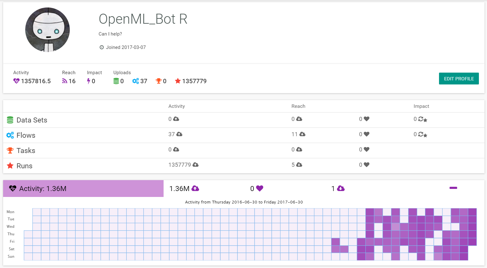
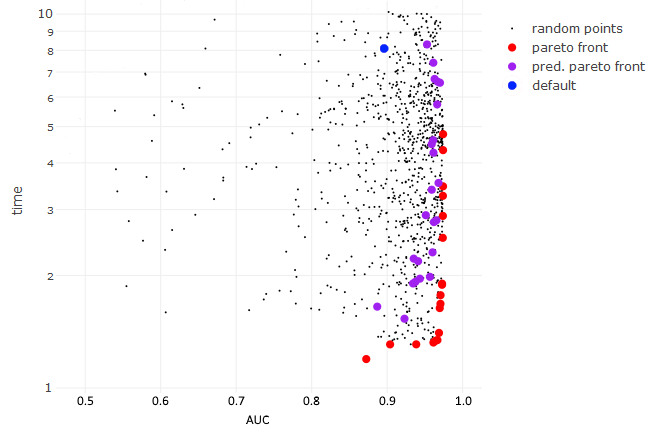
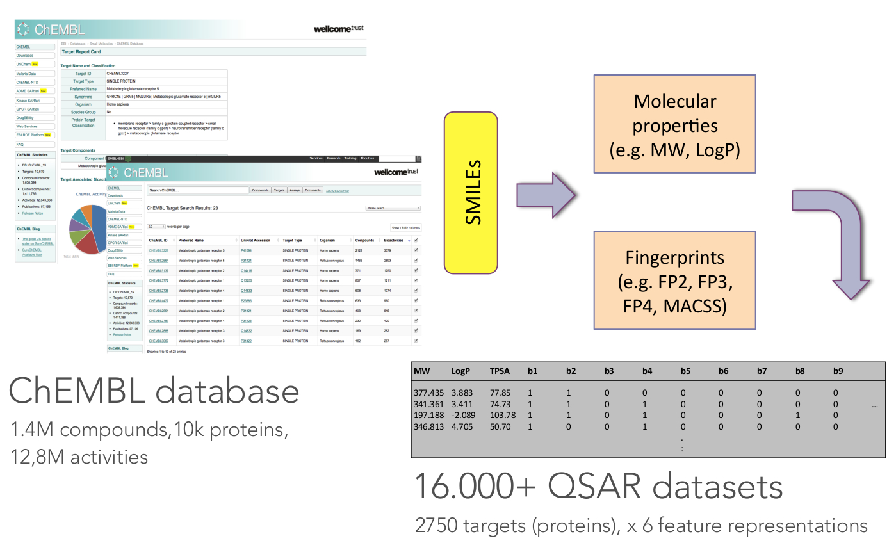

<!-- For this to work, install xaringan (devtools::install_github('yihui/xaringan')) -->

```{r setup, include=FALSE}
options(htmltools.dir.version = FALSE)
knitr::opts_chunk$set(dpi = 300, cache = TRUE, message = FALSE, eval = TRUE)
library(OpenML)
setOMLConfig(confirm.upload = FALSE)
```

- If you haven't done so yet, create an account on [OpenML.org](www.openml.org).

- If you haven't done so yet, install the OpenML R package and one of the packages farff or RWeka:
```{r, eval=FALSE}
install.packages("OpenML")
install.packages("farff")  # or install.packages("RWeka")
```
```{r}
library("OpenML")
```


- If something is not clear / you have a question / you have a problem, please **let us know**!

- We will have lots of practicals, if you are faster than others, you can 
check out https://www.openml.org/guide or help others.


---
Help


---
## OpenML useR! Tutorial

Learning goals:

- Understand the **potentials** of OpenML

- Use the OpenML **online platform** and the **R package**
  + Creating, uploading and downloading 
  + Running algorithms on OpenML tasks
  
- Know about cool OpenML **projects** and how to **get involved**


---
## Intro to openml.org 
<!-- [15 minutes, Joaquin] -->

> Resources:  
> [NIPS slides](https://github.com/openml/articles/blob/master/OpenML%20NIPS.pdf)

- Why, what, how, who, for whom
- Data sets, tasks, flows, runs (all have their own website)
- vocabulary: features = covariates, number of observations = number of instances, ML = Machine Learing (not maximum likelihood)


---
## Intro to the OpenML R package
> Resources:  
> [Paper](https://bitbucket.org/giuseppec/openml-r-paper/src)  
> [Tutorial](http://openml.github.io/openml-r/vignettes/OpenML.html)  
> [Reisensburg talk](https://bitbucket.org/giuseppec/openml-r-paper/src)  
> [Heidi's departement presentation](https://github.com/openml/articles/tree/master/slides/heidi_hittisau)  
> [mlr loves OpenML blogpost](http://mlr-org.github.io/mlr-loves-OpenML/)


---
### Motivating example: A small benchmarking study demo 
<!-- [5 minutes, Joaquin] -->

- What we want to do today: How to run a simple benchmark study
- Link to batchmark blogpost


---
### Installation and configuration 
<!-- [3 minutes, Jouaqin] -->

---
class:inverse

### *Practical*  
<!-- [5 minutes, Jouaqin] -->

- Install the OpenML R package (if you haven't done so yet)
- Add your API-key to your config file


---
### Listing 
<!-- [7 minutes, Jouaqin] -->

---
class:inverse

### *Practical*  
<!-- [5 minutes, Jouaqin] -->

- List all regression tasks corresponding to data sets with between 
  50 and 55 observations.


---

### Downloading 
<!-- [10 minutes, Joaquin] -->


---
class:inverse

### *Practical*  
<!-- [5 minutes, Joaquin] -->

- Download task with task ID XXX.


---
class: inverse
<!-- background-image: url(https://c1.staticflickr.com/5/4049/4468213356_07ffffd287_z.jpg) -->
background-image: url(slides_tutorial_files/cat.jpg)
background-size: cover

# BREAK TIME

???
Image credit: [Dave Dugdale](https://flic.kr/p/7NQLaj)

---

### Intro to mlr 
<!-- [15 minutes, Bernd] -->

---
### Running and uploading 
<!-- [10 minutes, Bernd] -->

The easiest way to create a run is to

- define a learner using the `mlr` package and to
- apply the learner to a task using the `runTaskMlr` function.

```{r}
# create a randomForest learner
lrn = makeLearner("classif.randomForest", mtry = 2)
# download a task
task = getOMLTask(task.id = 37)
# create the run
run.mlr = runTaskMlr(task, lrn)
```

- You can extract the `BenchmarkResult` object via

```{r}
convertOMLMlrRunToBMR(run.mlr)
```

<!--
- The `run.mlr` object contains three slots
  - `run`: contains the information of the run, i.e., the hyperparameter values and the learner predictions.
  - `bmr`: the `BenchmarkResult` object containing the results of the learner that is applied on the task.
  - `flow`: contains information about the algorithm.
-->
---
### Running and uploading 

- A run created with the `runTaskMlr` function can be uploaded via 
```{r}
run.id = uploadOMLRun(run.mlr)
run.id
```
- The OpenML server assigns a unique `run.id` to the run which 

  - can be used to download the run, i.e., via 
`r sprintf("getOMLRun(%s)", run.id)` or
  - to look up the run online on `r paste0("https://www.openml.org/r/", run.id)`.
  
- The server will automatically compute several evaluation measures for this run.
- It is also possible to upload runs with specific tags using the `tags` argument, so that finding the run with a specific tag becomes easier.

---
class:inverse
### *Practical*  
<!-- [25 minutes, Bernd] -->

- Run your favorite learner/algorithm (from mlr) on task XXX that you already downloaded.
Hint: use `listLearners()` to find appropriate learners for that task.
- Upload your run to OpenML. Add the tag "useR17". 
- Check if the upload worked by going to the website. Also check if the tag was
  added (you can also still add it on the website). 
- Check the predictive performance of the run by looking at several evaluation measures.
  
---
class:inverse
### *Practical*  

- Run your favorite learner/algorithm (from mlr) on task XXX that you already downloaded.
Hint: use `listLearners()` to find appropriate learners for that task.

```{r, echo = -c(3:4)}
# select the learner manually from lrn.list
lrn.list = listLearners()
# or ask for appropriate learners
appropriate.lrn = 
  listLearners(obj = convertOMLTaskToMlr(task)$mlr.task)
# run favorite learner
lrn = makeLearner("classif.rpart")
myrun = runTaskMlr(task, lrn)
```

- Upload your run to OpenML. Add the tag "useR17". 

```{r}
myrun.id = uploadOMLRun(myrun, tags = "useR17")
myrun.id
```

---
class:inverse
### *Practical*  

- Check if the upload worked by going to the website. Also check if the tag was
  added (you can also still add it on the website). 
  
Use the value from `myrun.id` and go to `r paste0("https://www.openml.org/r/", myrun.id)`.

- Check the predictive performance of the run by looking at several evaluation measures.

Go to `r paste0("https://www.openml.org/r/", myrun.id)` and scroll down to *Evaluation measures*. Maybe you have to wait a few seconds/minutes as the server needs to compute the evaluation measures.

You can also get the results via
```{r, eval = FALSE}
listOMLRunEvaluations(run.id = myrun.id)
```


---
## Tags
<!-- [10 minutes, Heidi] -->
Use tags to sort and find data, tasks, flows and runs.

 


```{r, eval=FALSE}
uploadOMLRun(myrun, tags = c("tag1", "tag2"))
```

---
## Studies
Studies are an extension of tags and get their own website.   
Tag must be `study_XX`


???
- With tasks we can e.g. combine several runs and find them again and make 
a little benchmarking study.
- The information what the tag means probably not obvious to other OpenML users:
this is why we created studies
- Study = tag + website with study information


---
## Studies


```{r, eval=FALSE}
uploadOMLRun(myrun, tags = "study_30")
```


---
## Evaluations
```{r, message=FALSE}
evals = listOMLRunEvaluations(tag = "study_30")
evals[1:3, c("data.name", "learner.name", "predictive.accuracy")]
```

```{r, echo=FALSE, fig.height=3}
evals$learner.name = as.factor(evals$learner.name)
evals$task.id = as.factor(evals$task.id)

library("ggplot2")
ggplot(evals, aes(x = data.name, y = predictive.accuracy, colour = learner.name,
                  group = learner.name, linetype = learner.name, shape = learner.name)) +
  geom_point() + geom_line() + ylab("Predictive Accuracy") + xlab("Data Set") +
  theme(axis.text.x = element_text(angle = -15, hjust = 0))
```


---
class:inverse

### *Practical*  
<!-- [10 minutes, Heidi] -->

- List the names of all data sets in study_27 
- Summarize the performance results of study_27 (look at predictive accuracy)

> Predictive accuracy is the percentage of instances that are classified correctly.   
> (Information like this can be found on [openml.org/a](https://www.openml.org/a))

- Bonus questions for fast solvers: 
  + What are the two different versions of ksvm?
  + What do the different setup.id s mean?

---
class:inverse

### *Practical*  
<!-- [10 minutes, Heidi] -->

- List the names of all data sets in study_27
- Summarize the performance results of study_27

```{r, message=FALSE, fig.height=2}
{{evals = listOMLRunEvaluations(tag = "study_27")}}
evals$setup.id = as.factor(evals$setup.id)

library("ggplot2")
ggplot(evals, aes(x = setup.id, y = predictive.accuracy, 
                  color = data.name, group = data.name)) + 
  geom_point() + geom_line() + 
  facet_grid(~ flow.name, scales = "free")
```

---
class:inverse
Why are there two different versions of the flow?
```{r}
fids <- unique(evals$flow.id)
flws <- lapply(fids, getOMLFlow)
flws
```

---
class:inverse
What are the different setup IDs?
```{r}
rids <- evals$run.id
runs <- lapply(rids, getOMLRun)
params <- lapply(runs, getOMLRunParList)
params[[1]]
params[[5]]
params[[19]]
```
The difference seems to be the type.

---
class:inverse
Let's add the type info to the evals data frame.
```{r}
evals$type <- sapply(params, 
                     function(x) ifelse(is.null(x$type$value), 
                                        NA, x$type$value))
evals$type


evals$type[is.na(evals$type)] <- getDefaults( 
  getParamSet( 
{{  convertOMLFlowToMlr(flws[[1]])}}
  ) 
)$type

evals$type
```

---
class:inverse
Now we can make a more understandable plot.
```{r, fig.height=3}
ggplot(evals, aes(x = type, y = predictive.accuracy, 
                  color = data.name, group = data.name)) + 
  geom_point() + geom_line() + 
  facet_grid(~ flow.name, scales = "free")
```


---
background-image: url(slides_tutorial_files/cool_stuff_text.png)
background-size: 70% auto
## Cool stuff people are already doing with OpenML
<!-- [15 minutes, Heidi] -->

???
Image-credit: https://commons.wikimedia.org

---
### OpenML Bot 
- Currently completing 100.000+ runs per day on Azure
- Exploring hyperparameters of xgboost,  ranger, and other popular machine learning algorithms
- Using 75 datasets from study_14



---
### OpenML meta learning: Making defaults great again!
- Choose between different performance measures (AUC, RMSE, ...)
- Predict the pareto front for this measure and the training time
- E. g. for xgboost: Prediction for hyperparameters on a new dataset, which will outperform the defaults



---
### OpenML in drug discovery
Predict which drugs will inhibit certain proteins   
(and hence viruses, parasites, ...)


<!--  -->
<!-- <object data="slides_tutorial_files/qsar.pdf" type="application/pdf" width="700px" height="700px"> -->
    <!-- <embed src="slides_tutorial_files/qsar.pdf"> -->
    <!--     This browser does not support PDFs. Please download the PDF to view it: <a href="slides_tutorial_files/qsar.pdf">Download PDF</a>.</p> -->
    <!-- </embed> -->
<!-- </object> -->

---
class: inverse
<!-- background-image: url(https://c1.staticflickr.com/6/5477/14101220086_a633ec9674_c.jpg) -->
background-image: url(slides_tutorial_files/fish.jpg)
background-size: cover

# Contributors needed! https://github.com/openml/OpenML/wiki/How-to-contribute
<!-- [10 minutes, Heidi] -->


???
Image credit: [Papahānaumokuākea Marine National Monument](https://flic.kr/p/neCvxt)

---
class: inverse, center, middle
background-image: url(slides_tutorial_files/OpenML_heart_OS.png)


