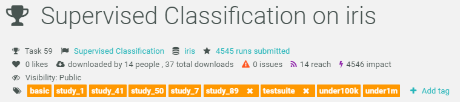

<!-- For this to work, install xaringan (devtools::install_github('yihui/xaringan')) -->

```{r setup, include=FALSE}
options(htmltools.dir.version = FALSE)
knitr::opts_chunk$set(dpi = 300, cache = TRUE, message = FALSE, eval = TRUE)
library(OpenML)
setOMLConfig(confirm.upload = FALSE)
set.seed(123)
```

## What is OpenML?

[openml.org](http://www.openml.org/)

```{r, out.width = "800px", eval=TRUE, echo = FALSE}

```

---
## Preliminaries

- If you haven't done so yet, create an account on [OpenML.org](www.openml.org).

- If you haven't done so yet, install the OpenML R package and one of the packages farff or RWeka:
```{r, eval=FALSE}
install.packages("OpenML")
install.packages("farff")  # or install.packages("RWeka")
```
```{r}
library("OpenML")
```


- If something is not clear / you have a question / you have a problem, please **let us know**!

- We will have lots of practicals, if you are faster than others, you can
check out https://www.openml.org/guide or help others.


---
Help


---
## OpenML whyR? Tutorial

Learning goals:

- Understand the **potentials** of OpenML

- Use the OpenML **online platform** and the **R package**
  + Creating, uploading and downloading 
  + Running algorithms on OpenML tasks
  
- Know about cool OpenML **projects** and how to **get involved**


---
### Installation and configuration 
<!-- [3 minutes, Joaquin] -->

You need OpenML and an ARFF reader

```{r, eval=FALSE}
install.packages(c("OpenML","farff"))
```
```{r}
library("OpenML")
```

---
To **upload** stuff to OpenML, you will need an OpenML API key

```{r, eval=FALSE}
setOMLConfig(apikey = "c1994bdb7ecb3c6f3c8f3b35f4b47f1f")
```

- Find your own key in your OpenML profile
- Without this key, you can still download and retreive information from OpenML

 
---
Permanently save your API disk to your config file (~/.openml/config)

```{r, eval=FALSE}
saveOMLConfig(apikey = "c1994...47f1f", overwrite=TRUE)
```

Other configuration options:
- `server`: default https://www.openml.org/api/v1
- `cachedir`: cache directory
- `verbosity`: 0 (normal) - 2 (debug)
- `arff.reader`: 'farff' (default) or 'RWeka'
- `confirm.upload`: default FALSE

View your configuration
```{r}
getOMLConfig()
```

---
### Listing datasets
<!-- [7 minutes, Joaquin] -->
```{r}
datasets = listOMLDataSets() # get first 5K results (LIMIT option) 
colnames(datasets)
```

---
### Listing datasets
```{r}
datasets[1:5, c(1,2,11,12)] # subset for compact display
```

```{r, eval = FALSE, echo = FALSE}
# library(DT)
# dt = datatable(datasets, extensions = "Buttons",
#   options = list(pageLength = 5, scrollX = TRUE, dom = 'Bfrtip', buttons = I('colvis')))
# formatStyle(dt, columns = TRUE, fontSize = '50%')
```

---
### Listing tasks 
```{r}
tasks = listOMLTasks() # limits results again
colnames(tasks)[1:20]
```

---
### Listing tasks 
```{r}
tasks[1:5, 1:9]
```


---
### Listing tasks 
```{r}
listOMLTasks(data.name = "sonar")[1:4, 1:8]
```

---
### Listing flows 
```{r}
flows = listOMLFlows()
flows[5768:5770, c(1, 3, 4, 6)]
```

---
### Listing runs and evaluations
Runs and evaluations need at least one of: task.id, flow.id, run.id, uploader.id, tag
```{r}
runs = listOMLRuns(task.id = 39)
runs[1:3, ]
```

```{r}
evals = listOMLRunEvaluations(task.id = 39)
evals[1:3, c("flow.name", "predictive.accuracy", "usercpu.time.millis")]
```

---
### Downloading datasets 
<!-- [10 minutes, Joaquin] -->
```{r}
sonar = getOMLDataSet(data.id = 40)
sonar
```

Extract the `data.frame` from the `OMLDataSet` object:
```{r}
sonar$data[1:5, 1:5] # or as.data.frame(sonar)[1:5, 1:5] 
```

---
### Downloading datasets 
For convenience, you can also download the dataset by its name
```{r}
getOMLDataSet(data.name = "sonar")
```

---
### Downloading tasks 
```{r}
task = getOMLTask(task.id = 39)
task
```

Extract the `data.frame` from the `OMLTask` object:
```{r}
task$input$data.set$data[1:3, 1:5] # or as.data.frame(task)[1:3, 1:5] 
```

---
### Downloading flows 
```{r}
flow = getOMLFlow(flow.id = 100)
flow
```

---
### Downloading runs
```{r}
run = getOMLRun(run.id = 9203978)
run
```

---
### Caching
- The package caches most objects on disk (cachedir in config)
- Results of listing calls are cached in memory
- You can also pre-fill the cache with objects, especially useful on clusters
```{r, eval = FALSE}
populateOMLCache(data.ids = 1:2, task.ids = 11:12)
```
```
cache/
├── datasets
│  └── 40
│      ├── dataset.arff
│      └── description.xml
├── flows
│  └── 100
│      └── flow.xml
├── runs
│  └── 9203978
│      ├── predictions.arff
│      └── run.xml
└── tasks
    └─── 39
        ├── datasplits.arff
        └── task.xml
```

---
### Running and uploading 
<!-- [10 minutes, Bernd] -->

Create a run:

1. Define a learner using the `mlr` package
2. Apply to a task using `runTaskMlr()`

```{r}
# create a randomForest learner
lrn = makeLearner("classif.randomForest", mtry = 2)
# download a task (or get from cache)
task = getOMLTask(task.id = 39)
# runs the learner locally, uses benchmark internally
run.mlr = runTaskMlr(task, lrn)
```
- The `run.mlr` object contains three slots
    + `run`: contains the information of the run, i.e., the hyperparameter values and the learner predictions.
    + `bmr`: the `BenchmarkResult` object containing the results of the learner that is applied on the task.
    + `flow`: contains information about the algorithm.
---


### Running and uploading
```{r}
run.mlr
```


<!-- From a didactical standpoint I would not include this: -->
<!-- 
- Extract the `BenchmarkResult` object via

```{r}
convertOMLMlrRunToBMR(run.mlr)
```
-->


---
### Running and uploading 

Upload run to OpenML server:
```{r, eval=FALSE}
run.id = uploadOMLRun(run.mlr)
```
```{r, echo=FALSE}
run.id = 9203978 # so we don't actually have to upload anything 
```
```{r}
run.id
```

- The server assigns a `run.id` which can be used to

  - download the run: `getOMLRun(run.id)`, or
  - look up the run online on `r paste0("https://www.openml.org/r/", run.id)`.
  
- Server auto-computes many evaluation measures from predictions

<!-- - It is also possible to upload runs with specific tags using the `tags` argument, so that finding the run with a specific tag becomes easier. -->
---

### Running and uploading 
Let's check that we can get our run back:
```{r}
getOMLRun(run.id)
```

---
## Tags
<!-- [10 minutes, Heidi] -->
Use tags to sort and find data, tasks, flows and runs.

 


```{r, eval=FALSE}
uploadOMLRun(myrun, tags = c("tag1", "tag2"))
```

---
## Studies
Studies are an extension of tags and get their own website.   
Tag must be `study_XX`


???
- With tasks we can e.g. combine several runs and find them again and make 
a little benchmarking study.
- The information what the tag means probably not obvious to other OpenML users:
this is why we created studies
- Study = tag + website with study information


---
## Studies


```{r, eval=FALSE}
uploadOMLRun(myrun, tags = "study_30")
```


---
## Evaluations
```{r, message=FALSE}
evals = listOMLRunEvaluations(tag = "study_30")
evals[1:3, c("data.name", "learner.name", "predictive.accuracy")]
```

```{r, echo=FALSE, fig.height=3}
evals$learner.name = as.factor(evals$learner.name)
evals$task.id = as.factor(evals$task.id)

library("ggplot2")
ggplot(evals, aes(x = data.name, y = predictive.accuracy, colour = learner.name,
  group = learner.name, linetype = learner.name, shape = learner.name)) +
  geom_point() + geom_line() + ylab("Predictive Accuracy") + xlab("Data Set") +
  theme(axis.text.x = element_text(angle = -15, hjust = 0))
```

---
### OpenML in science

Scientific publications: 
- [OpenML platform](https://arxiv.org/abs/1407.7722)
- [OpenML R package](https://arxiv.org/abs/1701.01293)
- [OpenML benchmark suite](https://arxiv.org/abs/1708.03731)

Repositories where you can contribute:

- **[openml/OpenML](https://github.com/openml/openml)**: The OpenML web application, including the REST API.
- **[openml/openml-python](https://github.com/openml/openml-python)**: The Python API, to talk to OpenML from Python scripts (incl. scikit-learn).
- **[openml/openml-r](https://github.com/openml/openml-r)**: The R API, to talk to OpenML from R scripts (incl. mlr).
- **[openml/java](https://github.com/openml/java)**: The Java API, to talk to OpenML from Java scripts.
- **[openml/openml-weka](https://github.com/openml/openml-weka)**: The WEKA plugin, to talk to OpenML from the WEKA toolbox.

## See also the guide on [how to contribute!](https://github.com/openml/OpenML/wiki/How-to-contribute) 

---
background-image: url(slides_tutorial_files/cool_stuff_text.png)
background-size: 70% auto
## Cool stuff people are already doing with OpenML
<!-- [15 minutes, Heidi] -->

???
Image-credit: https://commons.wikimedia.org

---
### OpenML Bot 
- Currently completing 100.000+ runs per day on Azure
- Exploring hyperparameters of xgboost,  ranger, and other popular machine learning algorithms
- Using 75 datasets from study_14


---
### OpenML meta learning: Making defaults great again!
- Choose between different performance measures (AUC, RMSE, ...)
- Predict the pareto front for this measure and the training time
- E. g. for xgboost: Prediction for hyperparameters on a new dataset, which will outperform the defaults


---
### OpenML in drug discovery
Predict which drugs will inhibit certain proteins   
(and hence viruses, parasites, ...)


<!--  -->
<!-- <object data="slides_tutorial_files/qsar.pdf" type="application/pdf" width="700px" height="700px"> -->
    <!-- <embed src="slides_tutorial_files/qsar.pdf"> -->
    <!--     This browser does not support PDFs. Please download the PDF to view it: <a href="slides_tutorial_files/qsar.pdf">Download PDF</a>.</p> -->
    <!-- </embed> -->
<!-- </object> -->

---
class: inverse, center, middle


Thanks to all the great folks who have been contributing    
to OpenML and the R package.    

