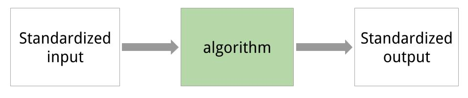
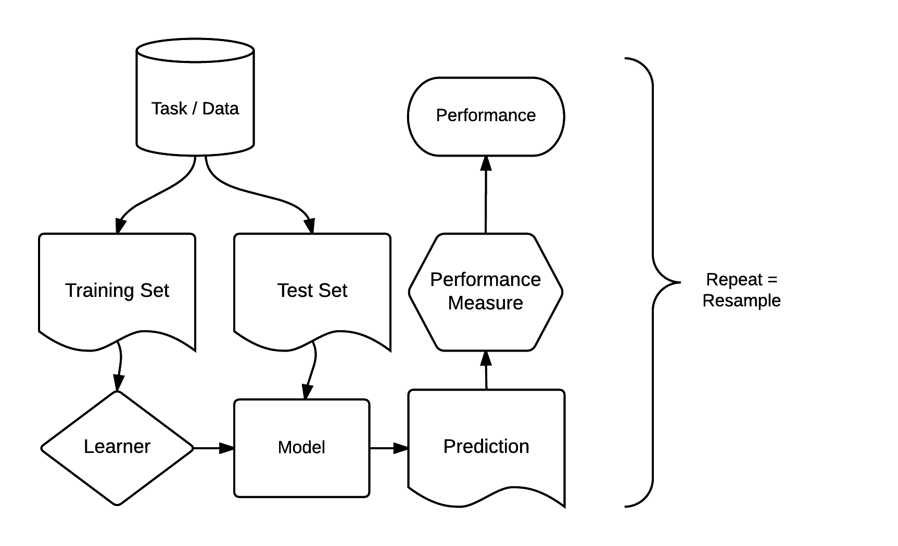

<!-- For this to work, install xaringan (devtools::install_github('yihui/xaringan')) -->

```{r setup, include=FALSE}
options(htmltools.dir.version = FALSE)
knitr::opts_chunk$set(dpi = 300, cache = TRUE, message = FALSE, eval = TRUE)
library(OpenML)
setOMLConfig(confirm.upload = FALSE)
set.seed(123)
```

---
class:center,middle
# Intro to mlr  

---

## Intro to mlr 
<!-- [15 minutes, Bernd] -->


mlr = General umbrella package for ML in R with standardized interface

```{r, out.width = "800px", echo = FALSE}

```
- Project home page: https://github.com/mlr-org/mlr
- 8-10 main developers, quite a few contributors
- Extensive online tutorial available, look there first
- Can ask questions in the github issue tracker

Install for the following examples:
```{r eval = FALSE}
install.packages(c("randomForest", "kernlab"))
```
`mlr` is atomatically installed when installing `OpenML`

---

## Intro to mlr 
- Classification, regression, survival, clustering, cost-sensitive, multilabel
- Includes > 160 basic learning algorithms
- Unified interface for the basic building blocks: 
  tasks, learners, resampling, hyperparameters
- Reflections: nearly all objects are queryable, i.e. you can ask for their properties and program on them
- Programmed in an OO fashion in S3 (everything is an object)
- Makes extensions and generic algorithms easy
```{r, out.width = "500px", echo = FALSE}

```

---


### mlr - Train, predict, performance
```{r}
task = makeClassifTask(data = iris, target = "Species")
print(task)
```
---

### mlr - Train, predict, performance
```{r}
lrn = makeLearner("classif.rpart", minsplit = 5)
lrn
model = train(lrn, task, subset = seq(1, 150, by = 2))
model
```
---

### mlr - Train, predict, performance
```{r}
pred = predict(model, task, subset = seq(2, 150, by = 2))
pred
perf = performance(pred, measures = list(mmce, ber))
perf
```
---

### mlr - Resample
- Crossvalidation, subsampling, bootstrapping, etc., with a single command
- Get a container object with
    + Mean performances and performances per resampling iteration
    + Predictions
    + Models (if you want that)  
```{r}
lrn = makeLearner("classif.rpart", minsplit = 5)
rdesc = makeResampleDesc("CV", iters = 2) # or use "cv2" object
r = resample(lrn, task, rdesc, 
  measures = list(mmce, ber), models = TRUE) 
r
```

```{r, eval = FALSE, echo = FALSE}
# ---
# ### mlr - Resample
# ```{r}
# r$aggr
# r$measures.test
# ```
# 
# ---
# ### mlr - Resample
# ```{r}
# head(as.data.frame(r$pred))
# r$models
# ```
```

---
### mlr - Benchmarking and Model Comparison
- Run one command to compare multiple learners on multiple data sets
- Get a (mergeable) container object with
    + Mean performances and performances per resampling iteration
    + Predictions
    + Models (if you want that)  
```{r}
# these are predefined in mlr for toying around:
tasks = list(iris.task, sonar.task)
learners = makeLearners(c("classif.rpart", "classif.randomForest"))
br = benchmark(learners, tasks, cv2)
br # again, you can access container in various ways
```

---
### mlr - More features and outlook

Uncovered features

- Many different NA imputation techniques
- Many feature filters
- Imbalancy correction (e.g SMOTE) 
- Use wrappers to extend learner functionality
- Simple nested resampling  
- Efficient tuning: 
  Bayesian optimization with mlrMBO and iterated F-racing with irace
- Multi-criteria optimization
- Feature selection through wrappers (forward, backward)
- Ensembles, generic bagging and stacking

What will come next
- Anomaly detection / one-class Classification
- Functional data handling
- Time series forecasting
- Efficient pipelining (https://github.com/mlr-org/mlrCPO)

---
class:center,middle
# Back to OpenML 

